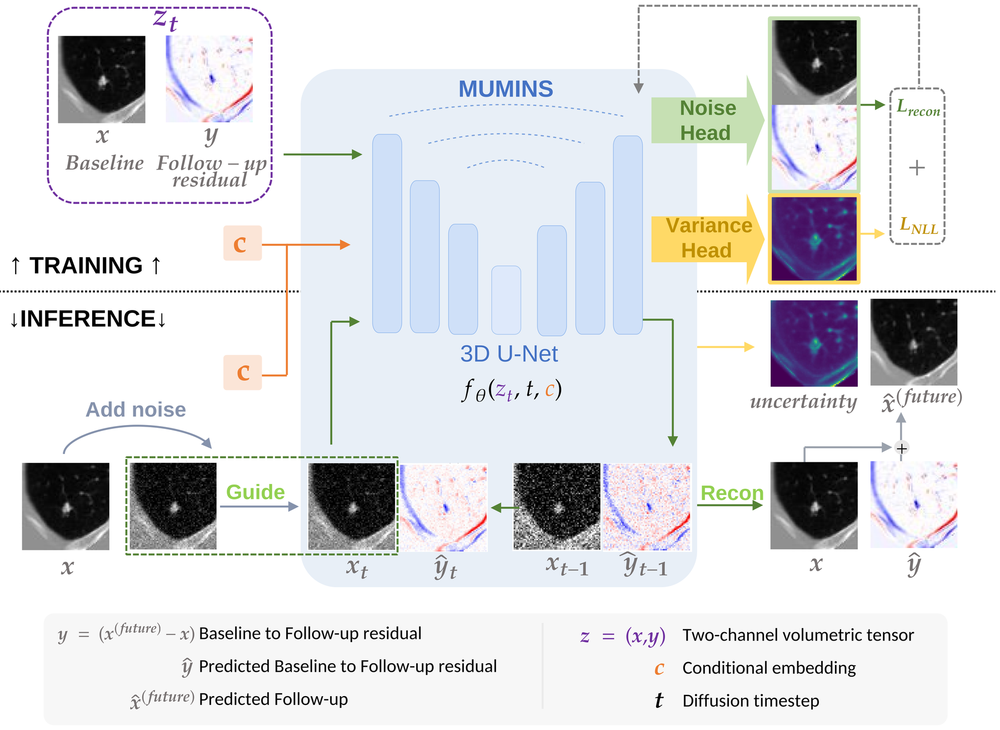

# 🔮 MUMINS: Metadata-conditioned Uncertainty-aware Medical Image Next-state Synthesis

[](https://arxiv.org/abs/TODO)
[](http://creativecommons.org/licenses/by-nc-nd/4.0/)



This is the official PyTorch implementation of **MUMINS**, a diffusion framework that forecasts a patient's follow-up 3D scan at an arbitrary future time interval from a single baseline scan — while jointly producing a voxel-wise **uncertainty map** in a single reverse-diffusion pass, with no Monte Carlo resampling required.

MUMINS jointly diffuses the baseline scan `x` and the baseline→follow-up residual `y` as a two-channel state `z = (x, y)`, re-injecting the *real* baseline at every denoising step so the residual stays anchored to patient-specific anatomy, while a variance head learns a per-voxel predictive uncertainty alongside the noise estimate via a hybrid NLL objective. The same architecture — no organ- or modality-specific components — is retrained separately to match or outperform domain-specific state-of-the-art methods on:

- 🫁 **Lung CT** — pulmonary nodule growth, following [NGP-Net](https://pubmed.ncbi.nlm.nih.gov/41557569/)'s preprocessing and splits.
- 🧠 **Brain MRI** — Alzheimer's disease progression on [OASIS-3](https://sites.wustl.edu/oasisbrains/).

📄 [Read the paper](https://arxiv.org/abs/TODO)

---

## 🧭 Pipeline Overview

Reproducing MUMINS means running three stages, in this order — each depends on the output of the previous one:

| # | Stage | Script | Produces / needs |
|---|-------|--------|-------------------|
| 1 | **Prepare data** | *(manual, see [🗂️ Data](#data))* | An OASIS-3 `our_B_filtered.csv` pair table, and/or an NGP-Net-format PNG root directory. Everything downstream reads from this. |
| 2 | **Train MUMINS** | `scripts/run_train_fsdp.sh` (multi-GPU FSDP) or `scripts/run_train_noFsdp.sh` (single-node) | A 3D U-Net diffusion checkpoint (`model-<N>.pt`) under `results_folder`. |
| 3 | **Run inference** | `scripts/run_inference.sh` | Synthesized follow-up volumes + per-voxel uncertainty maps (`.npy`), and a `results_*.csv` with MAE / PSNR / SSIM, using the checkpoint from step 2. |

## 📦 Dependencies

```bash
git clone <this-repo-url>
cd MUMINS

# 1) Install PyTorch matching your CUDA version first:
#    https://pytorch.org/get-started/locally/

# 2) Install the remaining dependencies
pip install -r requirements.txt
```

MUMINS was trained on multi-GPU H100 nodes using PyTorch FSDP; a single recent GPU is enough for inference, or to train the smaller (64³) lung-CT configuration.

## 🗂️ Data

All dataset paths are passed in via Hydra config/CLI overrides or the `scripts/*.sh` job scripts — **nothing is hardcoded**. Edit the `EDIT THESE` block at the top of each script to point at your own copies of the data below.

**🧠 Brain MRI — OASIS-3 (Alzheimer's progression)**
1. Request access to and download **[OASIS-3](https://sites.wustl.edu/oasisbrains/)** (Data Use Agreement required — we cannot redistribute the imaging data itself).
2. Preprocess the T1-weighted scans with **[turboprep](https://github.com/LemuelPuglisi/turboprep)** (registration, skull-stripping, SynthSeg segmentation, intensity normalization), as used by [BrLP](https://github.com/LemuelPuglisi/BrLP), at **1.5 mm isotropic** resolution.
3. Build a `our_B_filtered.csv` pair table with one row per (baseline, follow-up) pair, with the columns consumed by `dataset/OASIS_Dataset.py` — see the full column list and `split` rules in [Configuration](#configuration--training) below.
4. Point `OASIS_DATA_ROOT` (in the scripts) or `dataset.root_dir` (Hydra) at this CSV.

To save you from having to re-derive our exact experimental split, **[`data/oasis_samples.txt`](data/oasis_samples.txt)** lists every OASIS-3 scan we used by its own session ID (e.g. `OAS30001_MR_d0129_anat3`) which you can match against your own OASIS-3 download. See [Reproducing the OASIS-3 split](#reproducing-the-oasis-3-split).

**🫁 Lung CT — Pulmonary Nodule Growth (PNG)**

Follow the data access, preprocessing, and train/valid/test split instructions from the **[NGP-Net paper](https://pubmed.ncbi.nlm.nih.gov/41557569/)** ("A Lightweight Growth Prediction Network for Pulmonary Nodules") to build the longitudinal nodule dataset (`info.json` + image/label volumes). Point `NGP_DATA_ROOT` / `dataset.root_dir` at the resulting root directory; `dataset/NGP_Dataset.py` expects the same on-disk layout NGP-Net produces.

## ⚙️ Configuration & Training

Training and inference are both driven by [Hydra](https://hydra.cc/). The shipped configs (`train/config/**`, `test/confs/infer.yaml`) use `???` for every run-specific value — Hydra raises a clear "Missing mandatory value" error if you forget an override, instead of silently reading someone else's local path.

To train, run one of:

```bash
# Multi-GPU, PyTorch FSDP (used for our 128^3 OASIS runs)
sbatch scripts/run_train_fsdp.sh

# Single-node / DataParallel (used for our 64^3 lung-CT runs)
sbatch scripts/run_train_noFsdp.sh
```

Both call `train/train.py`, which can also be run directly (locally, without SLURM):

```bash
python train/train.py \
    model=ddpm dataset=OASIS \
    dataset.root_dir=/path/to/our_B_filtered.csv dataset.mode=train dataset.diff=True \
    model.diffusion_img_size=128 model.diffusion_depth_size=128 model.diffusion_num_channels=2 \
    model.batch_size=1 model.results_folder=/path/to/outputs \
    model.learned_variance=True model.timesteps=300 model.use_wandb=False
```

Before running the scripts, check and adjust the following:

| Variable | Description | Example |
|----------|--------------|---------|
| `PROJECT_ROOT` | Path to your local clone of this repo | `/path/to/MUMINS` |
| `OASIS_DATA_ROOT` / `NGP_DATA_ROOT` | Path to the pair CSV (OASIS) or dataset root (NGP) from [🗂️ Data](#data) | `/path/to/our_B_filtered.csv` |
| `RESULTS_ROOT` | Where checkpoints, logs, and inference outputs get written | `/path/to/outputs` |
| `DATASET` | `OASIS` or `NGP` | `OASIS` |
| `SIZE` | Cubic volume side length | `128` (OASIS) / `64` (NGP) |
| `TIMESTEPS` | Diffusion steps | `300` |
| `LEARN_VAR` | Learn the per-voxel variance head (uncertainty) | `True` |

The `our_B_filtered.csv` (OASIS) pair table needs (at least) these columns, read by `dataset/OASIS_Dataset.py`:

`PatientId, NoduleId, split, gender, pair, t0, t1, dt_days, dt_months, age0, age1, starting_diagnosis, followup_diagnosis, last_diagnosis, starting_image_path, followup_image_path, starting_segm_path, followup_segm_path, starting_image_uid, followup_image_uid, starting_brain_mm3, followup_brain_mm3`

`split` must be `train` / `valid` / `test`, with every pair for a given subject kept in the same split (no intra-patient leakage).

Set `model.use_wandb=False` (or skip `wandb login`) to disable Weights & Biases entirely — TensorBoard logs are always written under `<results_folder>/logs_tensorboard`.


## 🔮 Inference

```bash
sbatch scripts/run_inference.sh
```

which calls `test/inference.py` (Hydra config in `test/confs/infer.yaml`). Key options:

| Variable | Description |
|----------|--------------|
| `SAMPLER` | `ddim` (faster, configurable `SKIP_INTERVAL`) or `ddpm`. |
| `DIFF_BLUR_MODE` | How the acquisition-sharpness conditioning (`Δb`) is set at inference — see table below. |
| `num_seeds` | Stochastic samples per input: `1` for a quick pass, `>1` for downstream Monte-Carlo-style uncertainty comparisons. |
| `VAR_START` | Fraction of diffusion timesteps after which per-voxel variance propagation starts (delayed-start recursion — see the paper). |

`DIFF_BLUR_MODE` options:

| Mode | Meaning | Leakage? |
|------|---------|----------|
| `zero` | Assume unchanged acquisition protocol (`Δb = 0`) | None — the only deployable default |
| `gt` | Computed from the **true** follow-up | ⚠️ Oracle upper bound only — never report as the primary result |
| `mean` / `median` | Fixed train-split constant | None — fill in `DIFF_BLUR_CONSTANTS` in `test/inference.py` from your own training split first |

Outputs (per-seed `.npy` volumes, uncertainty maps, and a `results_*.csv` with MAE/PSNR/SSIM) land under `out_dir/samples/seed_<seed>/`.

## 🗺️ Reproducing the OASIS-3 split

`data/oasis_samples.txt` contains one row per scan actually used in our OASIS-3 experiments:

```
scan_uid,subject_id,split
OAS30001_MR_d0129_anat3,OAS30001,train
OAS30001_MR_d0757_anat3,OAS30001,train
...
```

`scan_uid` follows OASIS-3's own session naming (`<SubjectID>_MR_d<DaysFromEntry>_<anatN>`), so it matches directly against your own OASIS-3 download — no local file paths needed. Baseline→follow-up pairs are every (`t0`, `t1`) combination within the same subject and split, as read from your reconstructed `our_B_filtered.csv` (see [🗂️ Data](#data)).

## ⚖ License

This repository is released under **CC BY-NC-ND 4.0** (Attribution-NonCommercial-NoDerivatives) — see [LICENSE](LICENSE). In short: you may share this code as-is with attribution for non-commercial purposes, but may not distribute modified versions or use it commercially. Contact the authors if you need different terms.

## 📝 Citation

If you find this work useful, please consider to ⭐ star this repository and cite our paper:

```bibtex
@misc{oliveras2026mumins,
  title         = {{MUMINS}: Metadata-conditioned Uncertainty-aware Medical Image Next-state Synthesis},
  author        = {Oliveras Tous, Anna and Mar\'i, Roger and Redondo, Rafael and
                   Guardi\`a-Olivella, Oriol and Ugwu, Cynthia Ifeyinwa and Tost, Ana and
                   Nagarajan, Bhalaji and Migliorelli, Carolina and Ribas, Vicent and
                   Radeva, Petia},
  year          = {2026},
  eprint        = {TODO},
  archivePrefix = {arXiv},
  primaryClass  = {cs.CV},
}
```

**Authors:** Anna Oliveras Tous¹˒², Roger Marí¹, Rafael Redondo¹, Oriol Guardià-Olivella¹, Cynthia Ifeyinwa Ugwu¹, Ana Tost¹, Bhalaji Nagarajan³, Carolina Migliorelli¹, Vicent Ribas¹, Petia Radeva²˒⁴

¹ Eurecat, Centre Tecnològic de Catalunya, Barcelona, Spain
² Dept. de Matemàtiques i Informàtica, Universitat de Barcelona, Barcelona, Spain
³ Barcelona Supercomputing Center (BSC), Barcelona, Spain
⁴ Institut de Neurociències, Universitat de Barcelona, Barcelona, Spain

## 🙏 Acknowledgement

MUMINS builds on ideas from prior video/medical diffusion codebases, [DiffAtlas](https://arxiv.org/abs/2503.06748)-style joint image/mask (here, baseline/residual) diffusion with known-baseline injection, [U2Diff](https://arxiv.org/abs/2503.18589)-style single-pass NLL uncertainty. We thank the OASIS-3 and PNG/NGP-Net data providers.

---
